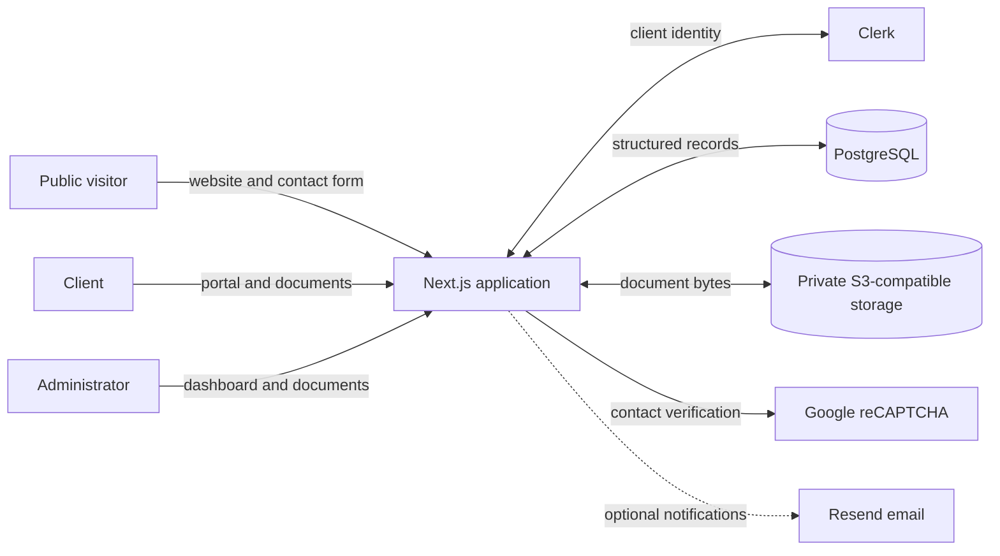
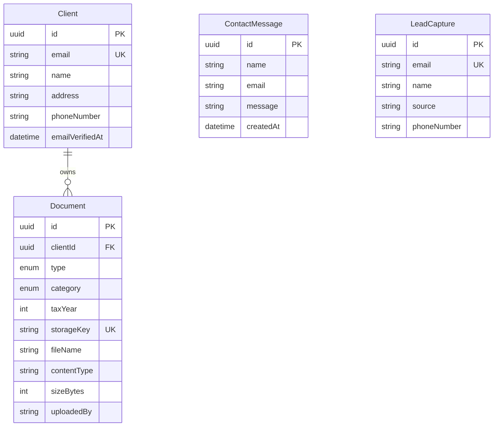

# Architecture

## Purpose and scope

This application combines a public tax and financial planning website with a private document exchange. It supports three principal workflows:

1. Prospective clients submit contact requests.
2. Authenticated clients maintain a profile and upload tax documents.
3. An administrator reviews client information and delivers completed returns.

Tax preparation, calculation, and electronic filing happen outside this application. The system is responsible for public intake, client records, secure source-document collection, and delivery of the finished return package.

The current architecture favors a small operational footprint and straightforward deployment. It is a modular monolith: the user interface, server-rendered pages, route handlers, authorization checks, and integration adapters live in one Next.js application, while durable data is delegated to PostgreSQL and S3-compatible object storage.

## System context

All access to database records and stored documents passes through the application. Browsers do not receive database credentials, object-storage credentials, or direct bucket URLs.

## Major architectural choices

| Concern | Current choice | Why | Consequence / revisit point |
| --- | --- | --- | --- |
| Application shape | Next.js App Router modular monolith | One deployable is appropriate for the current team and workload, while route and library boundaries keep concerns separated. | Split services only if independent scaling, release cadence, or ownership makes the operational cost worthwhile. |
| Rendering | Server Components by default; Client Components only for interactive forms and browser SDKs | Keeps database and credentialed work on the server while shipping client JavaScript only where browser state is needed. | Portal pages are dynamic because they depend on identity and current database state. |
| Client identity | Clerk authentication, mapped to a local `Client` by normalized primary email | Delegates password, session, verification, and sign-in UI concerns to an identity provider. Email mapping avoids duplicating authentication data. | A changed primary email can create an identity-linking problem. Store the immutable Clerk user ID before supporting email changes or multiple identities. |
| Administrator identity | HTTP Basic Auth enforced in `proxy.ts` | Minimal setup for a single trusted administrator and covers both `/admin` and `/api/admin/*` at one boundary. | It has no roles, per-user audit trail, revocation UI, or MFA. Replace it with Clerk roles or another identity provider before adding administrators or delegated access. |
| Structured persistence | PostgreSQL accessed through Prisma and its `pg` driver adapter | The client/document relationships, uniqueness rules, and migrations fit a relational model. Prisma supplies typed queries and a committed schema history while using the standard PostgreSQL driver. | Production deployments must run migrations before code that depends on them becomes active; connection-pool behavior follows `pg`. |
| Binary persistence | Private S3-compatible object storage | Tax documents are large opaque objects; keeping bytes out of PostgreSQL reduces database growth and backup pressure. | Database metadata and storage objects are not transactionally atomic. Add compensation jobs or reconciliation if volume or compliance requirements increase. |
| File access | Uploads, views, and downloads are mediated by server route handlers | Authorization is checked immediately before resolving a storage key, and bucket details remain private. | Application instances carry the bandwidth and memory cost. Move to short-lived signed URLs or multipart upload when files or traffic grow. |
| Form mutations | Server route handlers with `303` redirects for HTML forms | The pattern works without a separate client state framework and prevents accidental form resubmission on refresh. | A richer client experience may justify typed JSON endpoints or Server Actions later. |
| Contact delivery | Store first; schedule optional Resend email with Next.js `after()` | A missing or failed email integration does not discard the lead or message, and the response need not wait for email delivery. | Post-response work has no durable retry. Use a queue when delivery guarantees matter. |
| Automated testing | Vitest unit and boundary specs with V8 coverage | Fast deterministic tests protect validation, naming, security encoding, and external-response handling without provisioning services. | Add Playwright flows for authenticated browser behavior and route-level integration tests as those workflows expand. |
| Deployment | Vercel or a multi-stage Docker image deployed with Kamal | Supports a managed platform path and a self-hosted path from the same codebase. | Environment and database ownership must remain consistent between the two paths. |

## Runtime boundaries

### Presentation

- `src/app` contains public pages, portal pages, the admin dashboard, and route handlers.
- Pages render on the server unless browser interactivity requires a component marked with `"use client"`.
- `src/components` contains shared and workflow-specific user interface components.

### Application and integration logic

- `src/lib/client-auth.ts` resolves a Clerk session to the local client record.
- `src/lib/contact-submission.ts` validates and normalizes the untrusted contact JSON boundary.
- `src/lib/document-options.ts` owns document categories, return types, state validation, and tax-year choices.
- `src/lib/document-file.ts` creates application-controlled stored filenames.
- `src/lib/document-policy.ts` owns the upload size and MIME allowlists shared by client and server code.
- `src/lib/request-data.ts` provides typed form-data and unknown-object parsers.
- `src/lib/storage.ts` is the only S3 adapter and owns upload, streaming, and deletion operations.
- `prisma.config.ts` defines the Prisma CLI schema, migration, and datasource contract.
- `src/generated/prisma` is the generated, ignored Prisma TypeScript client produced during install and verification.
- `src/lib/prisma.ts` connects that client through `@prisma/adapter-pg` and exposes one development-safe instance.
- `src/lib/recaptcha.ts` isolates reCAPTCHA verification.
- `src/proxy.ts` establishes the top-level client and administrator access boundaries.

This organization keeps framework route handlers thin enough to coordinate a request while integration-specific details remain reusable.

## Data model

`Document` stores metadata and the opaque object key, never the document bytes. `DocumentType` distinguishes client source material from administrator-delivered documents, while `DocumentCategory` gives the portal a stable, queryable classification.

Deleting a client cascades to its document metadata at the database level. It does not automatically delete the corresponding storage objects, so client deletion must be implemented as an application workflow that cleans storage before deleting the database record.

## Important request flows

### Client upload

1. `proxy.ts` requires a valid Clerk session for the protected portal route.
2. The route resolves the Clerk user to a local `Client`.
3. The handler validates the category, supported tax year, MIME allowlist, and 25 MiB size limit.
4. The complete file is buffered by the application and written to a client-scoped storage prefix.
5. A `Document` row records the storage key and searchable metadata.
6. The client receives a `303` redirect with a success or error code.

If object storage succeeds and the database insert fails, the handler attempts a compensating object deletion. That cleanup can also fail, so storage lifecycle policies and periodic orphan reconciliation remain appropriate at higher volume.

### Client view or download

1. The handler resolves the authenticated local client.
2. A database query requires both the requested document ID and that client's ID.
3. Only the resulting storage key is sent to the storage adapter.
4. The application streams the object with either inline or attachment disposition.

The ownership predicate is part of the database query rather than a later in-memory check, reducing the chance of an insecure direct-object reference.

### Administrator document operations

`proxy.ts` protects the complete admin page and API namespace before a handler runs. Admin handlers can then query documents across clients, which is necessary for the dashboard and completed-return delivery workflow.

### Contact submission

1. The browser obtains a reCAPTCHA v3 token.
2. The API verifies the token with Google.
3. A PostgreSQL transaction stores the complete message and upserts a lead by the normalized email address.
4. If configured, Next.js `after()` schedules a Resend administrator notification and client confirmation after the response.

## Security model

The principal trust boundaries are the public internet, Clerk, PostgreSQL, and object storage. The application is responsible for authorization and for translating an authenticated identity into narrowly scoped database and storage access.

Current controls include:

- Private server-side storage credentials and non-public object keys
- Client ownership checks for every client document read, download, and delete
- A single admin boundary covering pages and APIs
- A 25 MiB upload limit and application-generated filenames
- A PDF/image MIME allowlist shared by browser inputs and server validation
- Strict TypeScript configuration, generated route types, and runtime narrowing of untrusted request data
- Optional SSE-KMS parameters for storage providers that support them
- reCAPTCHA verification before public contact data is stored
- Environment files, certificates, and keys excluded from Git and Docker contexts

Important limitations to address before materially increasing usage or compliance scope:

- The current Vitest suite covers reusable domain and integration-boundary logic, but not authenticated browser journeys or live route/storage integration. Add Playwright and service-backed tests before expanding those workflows or the team.
- File type is allowlisted but still based on browser-provided MIME metadata. Add magic-byte validation and malware scanning for a hardened intake pipeline.
- Uploads are buffered in application memory. Prefer direct multipart uploads with short-lived signed policies for larger files.
- The database and object store cannot participate in one transaction. Add compensating operations, reconciliation, and lifecycle policies.
- Basic Auth should become identity-provider-backed administrator authorization with MFA and auditable individual accounts.
- Provider-side encryption, access logging, retention, backup, recovery, and key rotation must be configured outside this repository.
- Durable background jobs are needed if email delivery or document-processing tasks become business-critical.

## Configuration and deployment

Environment variables are the only supported application configuration mechanism; `.env.example` documents that contract without containing credentials. The tracked Kamal configuration is also value-free: it loads machine-specific deployment coordinates from ignored `.kamal/deploy.env`, while ignored `.kamal/secrets` supplies credentials. Tracked `.kamal/*.example` files document both local contracts using placeholders only.

The Vercel build path runs `prisma migrate deploy` before the production build. Development and production builds follow the current Next.js defaults. The Docker path uses a multi-stage image, a non-routable placeholder database URL while generating the client, and BuildKit secrets for public build-time configuration. Real database credentials remain runtime secrets. Kamal supplies runtime secrets and can manage the PostgreSQL accessory defined in `config/deploy.yml`.

GitHub Actions intentionally performs dependency installation, linting, type checking, unit coverage, and compilation without connecting to a live database. The deploy-safety check remains `npm run vercel-build` against a disposable or designated deployment database.

## Evolution guidelines

Preserve these rules when extending the application:

1. Enforce authorization at the server boundary and scope database queries to the authenticated subject.
2. Keep storage keys and provider credentials server-only.
3. Put reusable domain validation outside route components.
4. Commit a Prisma migration for every schema change and exercise it against a fresh database.
5. Treat cross-system writes as failure-prone and define compensation behavior.
6. Record a new decision in this document when a change alters a trust boundary, persistence strategy, deployment topology, or identity model.
